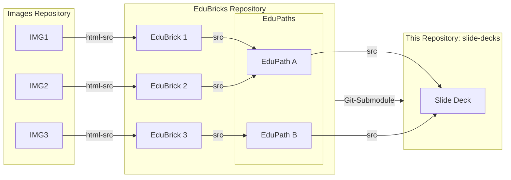

# Contribution Guide

## Git Submodule

To include EduBricks as git submodule, use the following command to add it to your local clone:

```bash
git submodule update --init --recursive
```

## Design

### Overall Design



### This repository

- [.bricks](bricks) = git submodule of https://github.com/EduBricksHub/EduBricks
- [./slide-decks](slide-decks) = location to compile slide decks, typically: 

```yaml
slide-decks/<NameOfSlideDeck>
├── custom  # = Slides only used in this slide deck's context
│   ├── 00-title.md
│   ├── 99-acknowledgements.md
│   └── goal.md
└── slides.md # = the slide deck to be rendered by slidev
```

#### slides.md

To compile slides from other slides, use this logic

```md
---
src: 'path/to/slide'
---
```

E.g.

---
src: '../../bricks/bricks/my-brick.md'
---


## Breaking Links

Due to the design of multi-layered source references, there's a risk of breaking links. To make sure, a (local) copy of a slide deck works as-is, export it to pdf... 


## Deploy slide deck via GitHub Pages

To deploy the slide decks publicly on https://edubrickshub.github.io/slide-decks/, they are added to the npm scripts and github deploy workflow.

1. Add a build script for that deck to the [package.json](package.json), e.g.
  ```json
  {
  ...
  "build:deckX": "slidev build --out ../../dist/deckX path/to/slides.md",
  ...
  }
  ```

2. Add to the respective build step to the [deploy.yml](.github/workflows/deploy.yml), e.g.

  ```yml
  - name: Build DeckX
    run: npm run build:deckX -- --base /${{github.event.repository.name}}/deckX
  ```

3. (Optional:) Link the slide deck in the "front page" [index.html](dist/index.html)


## Working with Slidev locally

[Slidev](https://sli.dev/) is a vue.js based framework to build slides from markdown files.

- This can also be used to compile slide decks from individual slides ("EduBricks") or smaller pre-defined slide decks ("EduPaths") 
- There's a [vscode extension](https://sli.dev/features/vscode-extension) available
- during watch or build it checks, that all referenced / reused images or imported bricks actually exist

### Install Slidev

```bash
npm install
```

### Watch a Slidev slide deck

You can see an example slide deck built with Slidev here using the following command. 
This should open a browser with the presentation, including some presentation controls in the bottom-left corner.

> Note: this will only work, if above `git submodule` are correctly added and pulled locally.

```bash
npm run dev -- slide-decks/2025-11-19_intro-rdm/slides.md
```

### Export a Slidev slide deck to pdf

You can directly export a slide deck to pdf using Slidev's browser controls or use the export command, e.g.

```bash
npm run export -- slide-decks/2025-11-19_intro-rdm/slides.md --output slide-decks/2025-11-19_intro-rdm/slides.pdf
```
