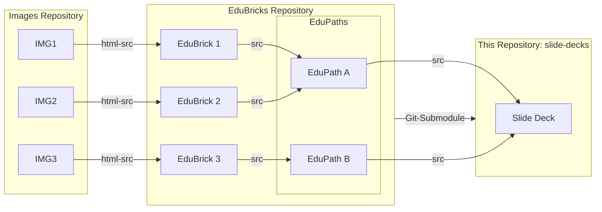

# Slide Decks

*EduBricks*-based slide decks for FAIR asset reuse. :stars:

Please visit https://edubrickshub.github.io/slide-decks/ to find the example slide decks.

## Idea

- This repository handles slides and styles (no assets, no images) and renders the slide decks via [Slidev](https://sli.dev/)
- Images can be handled and sourced from anywhere else (i.e. URLs) to keep this repo lightweight
- EduBricks & EduPaths are sourced as git submodule from https://github.com/EduBricksHub/EduBricks

## Contribution

Contributions are very welcome. Please check the [contribution guide](./CONTRIBUTING.md) for setups, technical details and design ideas.

## Overall Design

## License

This work is licensed under a [Creative Commons Attribution 4.0 International License][cc-by].

[cc-by]: http://creativecommons.org/licenses/by/4.0/
[cc-by-shield]: https://img.shields.io/badge/License-CC%20BY%204.0-lightgrey.svg
