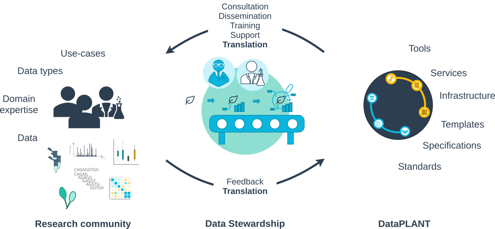
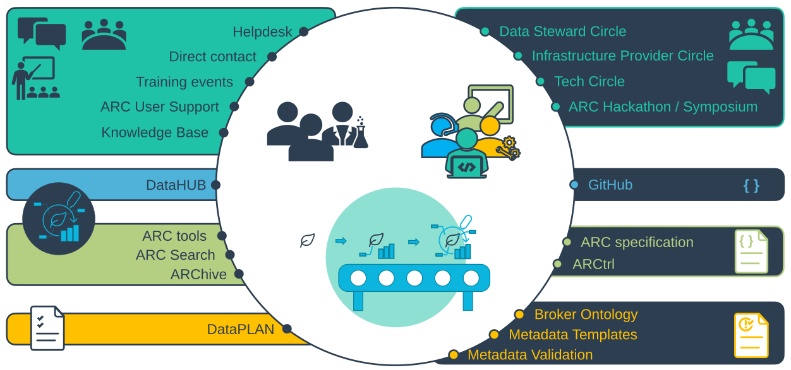

# Hands-On ARC Training

- [Workshop #13](https://events.hifis.net/event/3702/contributions/23835/) at [Boosting Biodata Bootcamp](https://events.hifis.net/event/3702/)
- Dominik Brilhaus, [CEPLAS Data](https://www.ceplas.eu/en/research/ceplas-data)

---
src: ./custom/participants.md
---

---
src: './custom/goals.md'
---

---
src: ../../EduBricks-EduPaths/EduBricks/rdm-fair.md#3
---

---
src: ../../EduBricks-EduPaths/EduBricks/dataplant/dataplant.md
---

---
src: ../../EduBricks-EduPaths/EduBricks/dataplant/dataplant-tailor-made-service-landscape.md
---

---

# Data Stewardship for a growing community

---

# Data Stewardship interaction platforms

---
src: '../../EduBricks-EduPaths/EduBricks/dataplant/dataplant-resources.md'
---

---
src: './custom/acknowledgements.md'
---

---
src: '../../EduBricks-EduPaths/EduBricks/arc-intro/002-annotated-research-context.md'
---

---
src: '../../EduBricks-EduPaths/EduBricks/arc-intro/003-the-arc-scaffold-structure.md'
---

---
src: '../../EduBricks-EduPaths/EduBricks/arc-intro/001-arc-standards.md'
---

---
src: '../../EduBricks-EduPaths/EduBricks/arc-intro/004-isa-abstract-model-in-a-nutshell.md'
---

---
src: '../../EduBricks-EduPaths/EduBricks/arc-intro/006-metadata-annotation-from-sample-to-data.md'
---

---
src: '../../EduBricks-EduPaths/EduBricks/arc-intro/007-modular-separation-of-experimental-processes.md'
---

---
src: '../../EduBricks-EduPaths/EduBricks/arc-intro/008-modular-separation-of-experimental-processes.md'
---

---
src: '../../EduBricks-EduPaths/EduBricks/arc-intro/018-templates-sops.md'
---

---
src: '../../EduBricks-EduPaths/EduBricks/arc-intro/005-isa-and-cwl-connected-by-similarity.md'
---

---
src: '../../EduBricks-EduPaths/EduBricks/arc-intro/011-data-analysis-cwl-workflows-and-runs.md'
---

---
src: '../../EduBricks-EduPaths/EduBricks/arc-intro/012-metadata-annotation-from-data-to-result.md'
---

---
src: '../../EduBricks-EduPaths/EduBricks/arc-intro/001-arc-standards.md'
---

---
src: '../../EduBricks-EduPaths/EduBricks/dataplant/datahub-plantdatahub.md'
---

---
src: ../../EduBricks-EduPaths/EduBricks/dataplant/fair-and-easy-one-entry-and-endless-possibilities.md
---

---
src: ../../EduBricks-EduPaths/EduBricks/dataplant/dataplant-archive.md
---

---
src: ../../EduBricks-EduPaths/EduBricks/dataplant/arc-revision-and-publication.md
---

---
src: '../../EduBricks-EduPaths/EduBricks/arc-intro/017-arc-ecosystem.md'
---

---
src: ../../EduBricks-EduPaths/EduBricks/arc-tools/arcitect.md
---

---
src: './custom/goals.md'
---

---
src: custom/exercise-starthere-checkpoint-1.md
---

---
src: custom/exercise-starthere-checkpoint-2.md
---

---
src: custom/exercise-starthere-checkpoint-3.md
---

